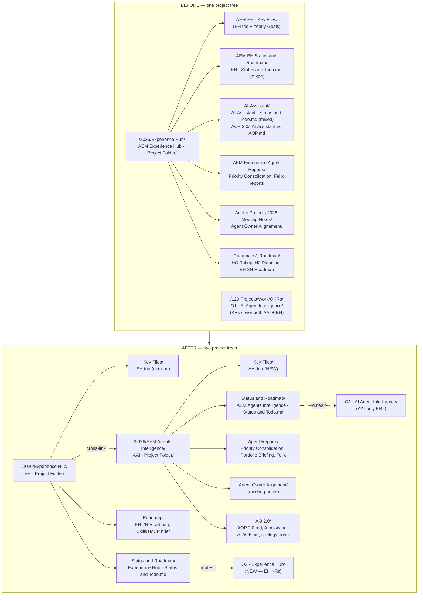

# Vault split plan — AEM Agents Intelligence vs Experience Hub

> **Executed.** Phase 1 landed 2026-05-03, Phase 2 structurally complete 2026-05-13 (see `project_aem_agents_intelligence.md`). This is the plan document that drove the split — filed here 2026-07-03, moved from the repo root (`Obsidian-migrataion-ai-intelligence_done_2026-05-04.md`, filename typo fixed). Historical record; some "After" details evolved post-execution (Meeting Notes went to neutral `2026/Meeting Notes/`, OKR folders became O1-O6).

## Context

The Obsidian vault was scaffolded around one project ("Experience Hub") in March 2026 when Pedro took over from Shankari. Eight weeks later the work has bifurcated into two real projects with different teams, different stakeholders, and different OKRs:

- **Experience Hub (EH)** — the AEM home-screen product. Pedro is PM of record. Team: Sorin (lead eng), Eugene (UX), Mircea, Anna Maria. Maps to G2 (EH Platform Integration) + G3 (EH Adoption & Growth). Surfaces: Skills+MCP, Contribution Model, Customer Profiling, Brand Concierge light-up, Experimentation page, MAU narrative.
- **AEM Agents Intelligence (AAI)** — the agent-portfolio reporting / strategy work. Pedro owns through Yanira (PgM AO-tracked agents), agent owners (Apoorva, Corey, Philippe, Greg, Brian, Nick, Gabriel/Mike), Felix, Lara, Varun, Conrad, Trent. Maps to G1 (Agent Intelligence & Reporting). Surfaces: Apoorva validation, Felix reports, Priority Consolidation view, Portfolio Monthly Briefing, AO 2.0 liaison, AEM-AO SLA, Loni+JM May 11 deck.

Three concrete symptoms today:

1. **Status & Todo files mix both.** `EH - Status and Todo.md` and `AI-Assistant - Status and Todo.md` were originally split by audience (product vs reporting), but the operating rule has been "mirror tasks across both." Mirroring made sense when the work was one stream; now it obscures ownership. Half the focus items in each file belong cleanly to one project or the other.
2. **OKR folder O1 ("AI Agent Intelligence") mixes both.** Most KRs are pure AAI (Apoorva punch-list, Loni+JM deck, Priority Consolidation, monthly briefing, agent-owner sign-offs, BVR Discovery, AEM-AO SLA). EH-flavored work (Skills+MCP surface, Contribution Model, EH MAU driver narrative) has no OKR home and is squatting in O1 by default.
3. **The trio (Stakeholder Map / State of the Project / 1-1 Questions) only exists for EH.** AAI has no Stakeholder Map of its own (Yanira, Felix, Lara, Karthik, Angela, Conrad, Trent, Sergei live as scattered entries in the EH map), no State of the Project narrative (it lives as a 700-line memory file), and no 1-1 questions file for Yanira. Yanira is the AAI counterpart of Sorin and deserves the same scaffolding.

The 2-project split formalises what's already happening operationally. It also lets the May 11 Loni+JM deck draw cleanly from the AAI surface without the EH product roadmap noise mixed in.

## Target shape

## Renames

These are filename / folder name changes only — content stays:

| From | To |
|---|---|
| `2026/Experience Hub/AEM Experience Hub - Project Folder/AI-Assistant/` (subfolder) | `2026/AEM Agents Intelligence/AAI - Project Folder/AO 2.0/` (rehome + rename — the folder was never just "AI Assistant") |
| `…/AI-Assistant/AI-Assistant Status and Roadmap/AI-Assistant - Status and Todo.md` | `…/AAI - Project Folder/Status and Roadmap/AEM Agents Intelligence - Status and Todo.md` |
| `…/AI-Assistant/AI-Assistant-Findings.md` | `…/AAI - Project Folder/AO 2.0/AI Assistant Findings.md` |
| `EH - Status and Todo.md` | `Experience Hub - Status and Todo.md` (full project name; matches AAI counterpart) |
| `Adobe Projects 2026 Meeting Notes/Agent Owner Alignement/` | `…/AAI - Project Folder/Agent Owner Alignment/` (typo fix + rehome) |

## Recategorisation — what moves where

**Move OUT of EH project folder, INTO new AAI project folder:**

- `AEM Experience Agent Reports/` (entire folder — Priority Consolidation View, Felix report compliance notes, Portfolio Monthly Briefing spec)
- `Adobe Projects 2026 Meeting Notes/Agent Owner Alignement/` (entire folder)
- `Roadmaps/H2 2026 HC Rollup for AI agents.md`
- `2026/Site Advisory Agent (AEMAGT-2).md` (agent reference doc — belongs with AAI)
- `AI-Assistant/AOP 2.0/` (entire folder — AO 2.0 is agent strategy)
- `AI-Assistant/AI Assistant vs AOP.md`
- `AI-Assistant/AI-Assistant-Findings.md`
- `AI-Assistant/AI-Assistant Status and Roadmap/AI-Assistant - Status and Todo.md` (after content split — see below)

**Stays in EH project folder:**

- `AEM EH - Key Files/` (all four files — EH trio + Bertrand 1-1 + 2026 Yearly Review Goals; the Goals doc covers all three G1/G2/G3 but originated as an EH artifact and EH owns 2 of 3 goals — leave in place, cross-link from AAI)
- `AEM EH Status and Roadmap/EH - Status and Todo.md` (rename to `Experience Hub - Status and Todo.md`)
- `Roadmap/Home 2H2026 Roadmap - Experience Hub EH.md`
- `EH as the Skills and MCP Surface - Bertrand brief.md`
- `202603 - EH Evolutions proposal.md`
- `🎯 AEM Experience Hub MOC.md` (rename to MOC just for EH; create separate AAI MOC)
- `Roadmaps/H2 2026 Planning - Initiatives and Roadmaps.md` (broader-than-EH but more product-narrative than agent-intelligence — stays EH, cross-link from AAI)

**OKR folder changes:**

Keep `O1 - AI Agent Intelligence/` for AAI. KRs already there are correct; no moves needed in:
- `Close Apoorva validation punch-list.md` (KR1)
- `3 agent owners signed off on report.md` (KR2)
- `Deliver Loni + Jean-Michel presentation.md` (KR3)
- `Ship Priority Consolidation view.md` (KR4)
- `Stable monthly metrics deck.md`
- `Define SLA for AEM Agents with AEP.md`
- `Update Reports weekly for AI Intelligence.md`
- `Validate AI Intelligence Numbers with 3 agent owners by mid-may.md`
- `BVR - Discovery Agent Methodology.md`

Create `O2 - Experience Hub/` with new KR notes for EH-owned work currently squatting nowhere:
- `🎯 Objective.md` — frame from G2 + G3 Yearly Goals.
- `📊 KR Board.md` — same kanban template as O1.
- `Skills + MCP Surface — Bertrand brief sent.md` (KR — currently held in EH brief doc, no OKR home)
- `Contribution Model — pilot live.md` (KR — Eugene+Sorin email thread, +Add Extension pilot)
- `EH MAU driver narrative — substantiated.md` (KR — Bertrand's "key driver" claim April 13, needs data backing)
- `Brand Concierge Summit light-up.md` (closed; archive in Done column)
- `Experimentation page integration — feature flag live.md` (KR with Jim Stoklosa team)
- `Report hosting — CDN+Okta path live.md` (KR with Quentin)

## Rework — content that needs splitting, not just moving

### Status & Todo files

Current state: each of the two files has a roughly 50/50 mix of EH + AAI items. Split content by owning project, not by mirror.

**`Experience Hub - Status and Todo.md`** keeps:
- Skills + MCP surface, Contribution Model, Customer Profiling
- Brand Concierge light-up (closed, in archive)
- Experimentation page integration
- Prompt search bug, EH adoption metrics, Fu Chi prompt-recommendation pipeline integration
- Sorin / Eugene / Mircea threads
- MAU narrative substantiation
- Cole Connelly / Prompt Library Platform consumption
- Report hosting CDN + Okta

**`AEM Agents Intelligence - Status and Todo.md`** (new file, derived from current `AI-Assistant - Status and Todo.md` plus AAI items lifted out of the EH file) keeps:
- Apoorva punch-list (items 2/3/5/6 due April 27 — already past on Pedro's calendar; refresh dates)
- Felix reports + report-to-JIRA pipeline + tag taxonomy with Lara
- Varun Kalra deep-skill absorption (5 next-actions from April 22 sync)
- Philippe BVR review + Governance capability metrics
- Rubin tagging (Karthik, Angela, Silvia, Uma)
- Priority Consolidation view ship to prod
- Portfolio Monthly Briefing v0 → v1
- AO 2.0 liaison + AEM-AO SLA
- Loni + JM May 11 prep — JM warm-up Claude project (SD-2), $500K trace (SD-3)
- Yanira QBR ownership ask
- Vaishnav Gorur PMM confirmation (SD-1 Haresh)
- Agent owner alignment standing meeting threads

**Mirror rule retired.** Memory file `feedback_mirror_tasks_across_status_files.md` becomes obsolete and needs replacement with: "Tasks live in their owning project's Status & Todo. If a task is genuinely cross-project (e.g., Skills+MCP surface depends on AO 2.0 readiness), keep the task in the project that ships it; cross-link the dependency in the other project's Focus section."

### EH trio — extract AAI content

Current EH trio carries AAI content that needs to move:

- **`Experience Hub - Stakeholder Map.md`** — extract AAI-only stakeholders into the new AAI Stakeholder Map: Yanira Castaneda, Felix Delval, Lara, Varun Kalra, Apoorva Gupta, Ankur Arora, Corey Dulimba, Philippe Kapfer, Greg Klebus, Brian Chaikelson, Nick Whittenburg, Gabriel Walt, Mike Tilburg, Conrad Woltge, Trent Davies, Ken Russell, Sergey Generalov, Ian Boston, Karthik Penikalapati, Angela Han, Silvia Mulet Ferre, Uma Subbu, Jaclyn Eckersley, Vaishnav Gorur, Tina Nicu, Akin (PMM), Laurentiu Odoleanu, Remus Stratulat, Pritie Sharda, Hyman Chung, David, Juliana Campbell, Robert Guthrie, Marius Duta, Amit Arora, Prashant, Georgeta Vladescu-Viezure, Mark Szulc, Jim Stoklosa (dual — EH for experimentation surface, AAI as report contributor for EPA), Mircea Salan (EH only).

  Cross-link rule: anyone who appears in both maps gets a row in both, with role-specific notes per project.

- **`Experience Hub - State of the Project.md`** — extract AAI sections (the 700-line `project_experience_hub.md` memory file is closer to a State-of-Project for AAI than for EH; lift the agent-intelligence narrative out and seed the new AAI State of the Project from it). EH State of the Project keeps: EH product status, team capacity, Skills+MCP, Contribution Model, Customer Profiling, Brand Concierge, Experimentation, MAU narrative, EH adoption data.

- **`Experience Hub - Questions for Next 1-1 with Sorin.md`** — already EH-clean, no changes.

- **`Experience Hub - Questions for Next 1-1 with Bertrand.md`** — Bertrand is the manager for both projects. Stays in EH folder for path stability; create alias / shortcut from AAI folder so it's reachable from both. New entries should tag `[EH]` or `[AAI]` per question to keep the file useful at split level.

### AAI trio — net-new files

Create in `2026/AEM Agents Intelligence/AAI - Project Folder/Key Files/`:

- **`AEM Agents Intelligence - Stakeholder Map.md`** — seeded from extraction above. Group by lane: AEM Agent PMs (the 7-list), Agent PgMs (Yanira, Pritie, Robert, Marius, Amit, Prashant, Georgeta, Juliana), AO/AEP (Conrad, Trent, Ken, Sergei, Ian, Manas), Data/Reporting (Felix, Lara, Varun, Karthik, Angela), Design (Silvia, Uma), Leadership (Loni, JM, Jaclyn, Bertrand, Shankari), PMM (Tina, Akin, Vaishnav, Haresh).

- **`AEM Agents Intelligence - State of the Project.md`** — seeded from `project_experience_hub.md` AAI sections. Structure: What we measure today / What's not measured / Apoorva validation status / Three-tier reporting architecture (QBR → Portfolio Briefing → per-agent) / AO 2.0 strategic position / Cross-org influence map / Open risks (compliance, profitability, $500K cost line).

- **`AEM Agents Intelligence - Questions for Next 1-1 with Yanira.md`** — Yanira is Pedro's AAI counterpart for joint AO 2.0 strategy + agent portfolio framing. Seed from open Yanira threads: QBR ownership ask, Monday Agent Alignment agenda, profitability framing, HC rollup per agent, headcount methodology.

### Yearly Review Goals doc

`AEM EH - Key Files/Experience Hub - 2026 Yearly Review Goals.md` covers G1 (AAI), G2 (EH), G3 (EH) — currently lives only in EH key files. Two options, recommend the second:
- ❌ Duplicate the file into AAI key files (rot risk).
- ✅ Leave canonical file in EH; create `AEM Agents Intelligence - Key Files/2026 G1 Goal Reference.md` as a 5-line pointer with the G1 paragraph quoted and a link back. The full goals doc updates in one place.

### MOC

`🎯 AEM Experience Hub MOC.md` — rework into EH-only MOC. Create new `🎯 AEM Agents Intelligence MOC.md` in the AAI project folder. Each MOC links to its own trio + Status & Todo + OKR.

## Repo-side updates (companion to vault changes)

Files in `/home/user/repo/.claude/memory/` and `/home/user/repo/CLAUDE.md` reference vault paths and the current single-project model. They need to track the split:

| File | Change |
|---|---|
| `.claude/memory/MEMORY.md` | Add new entries: `project_aem_agents_intelligence.md`, `reference_okr_o2_experience_hub.md`. Update `project_experience_hub.md` description to "EH-only after split". |
| `.claude/memory/project_experience_hub.md` | Trim to EH-only content. Move AAI sections (Apoorva punch-list, Felix reports, Rubin, AO 2.0 strategy, Varun, BVR, Portfolio Briefing, May 11 deck, SD-1/2/3, Yanira QBR, Vaishnav PMM) into new `project_aem_agents_intelligence.md`. |
| `.claude/memory/project_aem_agents_intelligence.md` (new) | All AAI narrative including agent ownership matrix, three-tier reporting architecture, AO 2.0 strategy, Loni+JM May 11 plan, Senior Director moves SD-1/2/3, vault path to `2026/AEM Agents Intelligence/`. |
| `.claude/memory/reference_okr_structure.md` | Rename to `reference_okr_o1_aem_agents_intelligence.md` and add sibling `reference_okr_o2_experience_hub.md`. |
| `.claude/memory/feedback_update_trio.md` | Rewrite: there are now TWO trios. Updates routed by project — "after EH meeting analysis update EH trio; after AAI meeting analysis update AAI trio; if cross-project, update both". |
| `.claude/memory/feedback_mirror_tasks_across_status_files.md` | Rewrite as anti-rule: "Tasks live in their owning project's Status & Todo file; do not mirror. Cross-link in the dependent project's Focus if the task is a blocker." Or delete and replace with a new feedback file `feedback_route_tasks_by_project.md`. |
| `.claude/memory/feedback_session_start.md` | Update "always pick up where we left off on Experience Hub" → "always check both EH and AAI Status & Todo files at session start; ask which project Pedro wants to work on if not obvious". |
| `.claude/memory/feedback_status_rollup_not_tracker.md` | Update OKR backlinks to reflect O1 (AAI) + O2 (EH) routing. |
| `CLAUDE.md` | "Common PM Tasks Routing" — split EH-specific vs AAI-specific rows where they differ. Update path references. |
| `projects/adbe-experience-hub/` | Either rename to `projects/adbe-experience-hub-and-aai/` (no — clutters) or split into two project subfolders: `projects/adbe-experience-hub/` (existing) and `projects/adbe-aem-agents-intelligence/` (new — empty scaffold matching EH structure: README, context/, doc/, outcomes.md). |

## Phasing — do NOT do this in one shot

May 11 Loni + JM meeting is 8 days out. The week of May 4 is dense (Bertrand review of Portfolio Briefing Mon AM, agent sync 4pm, JM warm-up Claude project, $500K trace, Priority Consolidation polish). A full vault refactor in this window will lose Pedro's place mid-prep.

Two phases:

**Phase 1 — pre-May 11 (this weekend, ~1-2 hours)**
Scaffold the new structure in parallel without moving files yet:
- Create `2026/AEM Agents Intelligence/AAI - Project Folder/` empty tree.
- Create AAI trio files (Stakeholder Map, State of the Project, Questions for Yanira) — seed by *copying* relevant sections from EH trio, do not delete from EH yet.
- Create `O2 - Experience Hub/` OKR folder with Objective + KR Board scaffold; do not create individual KR notes yet.
- Create new `AEM Agents Intelligence - Status and Todo.md` from a copy of `AI-Assistant - Status and Todo.md`. Leave both files live during transition; mark the new AAI file as canonical, add deprecation banner to old file.
- Update `.claude/memory/project_experience_hub.md` to add a "Two-project split — in progress" header section pointing to new files. Don't trim yet.

This gives Pedro a working AAI scaffold for the May 11 prep week without disturbing existing paths the running work depends on.

**Phase 2 — post-May 11 (weekend after the meeting, ~3-4 hours)**
Execute moves and content extraction:
- Move folders per "Recategorisation" section above.
- Extract AAI content from EH trio → AAI trio. Delete duplicated content in EH trio.
- Decommission `AI-Assistant - Status and Todo.md` (archive with date suffix).
- Trim `project_experience_hub.md`; populate `project_aem_agents_intelligence.md`.
- Update `MEMORY.md`, `CLAUDE.md`, all feedback files.
- Create new EH-specific KR notes in `O2 - Experience Hub/`.
- Update Obsidian backlinks (run a vault-wide search for old paths and rewire — Obsidian won't auto-fix moves done outside its UI).
- Commit with `pattern: vault split — EH vs AAI two-project structure`.

## Critical files to touch (path index for execution)

In the vault (paths relative to `/Users/pedrofer/Library/CloudStorage/GoogleDrive-maprilpedro@gmail.com/My Drive/ObsidianVault/`):

- `020 Professional/Adobe/Projects/2026/Experience Hub/AEM Experience Hub - Project Folder/AEM EH - Key Files/Experience Hub - Stakeholder Map.md`
- `020 Professional/Adobe/Projects/2026/Experience Hub/AEM Experience Hub - Project Folder/AEM EH - Key Files/Experience Hub - State of the Project.md`
- `020 Professional/Adobe/Projects/2026/Experience Hub/AEM Experience Hub - Project Folder/AEM EH Status and Roadmap/EH - Status and Todo.md`
- `020 Professional/Adobe/Projects/2026/Experience Hub/AEM Experience Hub - Project Folder/AI-Assistant/AI-Assistant Status and Roadmap/AI-Assistant - Status and Todo.md`
- `020 Professional/Adobe/Projects/2026/Experience Hub/AEM Experience Hub - Project Folder/AEM Experience Agent Reports/` (entire folder)
- `020 Professional/Adobe/Projects/2026/Experience Hub/AEM Experience Hub - Project Folder/Adobe Projects 2026 Meeting Notes/Agent Owner Alignement/`
- `120 Projects/Work/OKRs/O1 - AI Agent Intelligence/` (rename considered, but content is correct — leave folder name)
- `120 Projects/Work/OKRs/O2 - Experience Hub/` (NEW)

In the repo:

- `/home/user/repo/.claude/memory/MEMORY.md`
- `/home/user/repo/.claude/memory/project_experience_hub.md`
- `/home/user/repo/.claude/memory/project_aem_agents_intelligence.md` (NEW)
- `/home/user/repo/.claude/memory/reference_okr_structure.md` (rename + sibling)
- `/home/user/repo/.claude/memory/feedback_update_trio.md`
- `/home/user/repo/.claude/memory/feedback_mirror_tasks_across_status_files.md`
- `/home/user/repo/.claude/memory/feedback_session_start.md`
- `/home/user/repo/CLAUDE.md`
- `/home/user/repo/projects/adbe-aem-agents-intelligence/` (NEW scaffold matching EH layout)

## Reused patterns (don't reinvent)

- **Trio template** — copy structure exactly from existing `Experience Hub - Stakeholder Map.md` etc. Same H2 sections, same table columns. The trio works; just instantiate it for AAI.
- **Status & Todo template** — copy structure from `EH - Status and Todo.md`. Focus table with KR backlinks (rule from `feedback_status_rollup_not_tracker.md`), Conversations & Links section (`feedback_conversation_link_optional.md`), Session log.
- **OKR folder template** — copy structure from `O1 - AI Agent Intelligence/`. Same kanban board format, same KR note layout with Todoist-backed task IDs.
- **Memory project file template** — copy structure from current `project_experience_hub.md` (front-matter + sections). Split content; keep format.
- **Cross-project task linking** — rule from `feedback_status_rollup_not_tracker.md`: link via `[[KR Note|KR#]]` backlinks. Same pattern works across projects: `[[Skills + MCP Surface|EH-KR1]]` from AAI Focus.

## Verification

After Phase 1:
- Open new AAI Stakeholder Map — confirm Yanira, Felix, Apoorva, Karthik present.
- Open new AAI Status & Todo — confirm Apoorva punch-list, Portfolio Briefing, JM warm-up appear; confirm EH-only items (Brand Concierge, Skills+MCP brief send) do NOT.
- Open EH Status & Todo (renamed) — confirm Sorin/Eugene/Mircea threads + Skills+MCP appear; confirm Apoorva/Felix/Rubin do NOT.
- Open Obsidian graph view — confirm two distinct project clusters with Bertrand 1-1 file as connector.
- Spot-check 3 backlinks: AAI Focus row → KR1 Apoorva note; EH Focus row → new EH KR note; AAI State of Project → Felix report file.

After Phase 2:
- Search vault for `AI-Assistant/` references — confirm zero (or only in archive folder).
- Search vault for `EH - Status and Todo` (without `Experience Hub` prefix) — confirm zero.
- Open `project_experience_hub.md` in repo — confirm length dropped substantially (target <300 lines from 711).
- Open `project_aem_agents_intelligence.md` — confirm contains AAI sections.
- Run `git status` in repo — confirm renames + new files staged correctly.
- New session: ask Claude "where do we stand on the agent reporting work?" — should route to AAI files only.
- New session: ask Claude "what's the EH MAU narrative status?" — should route to EH files only.
